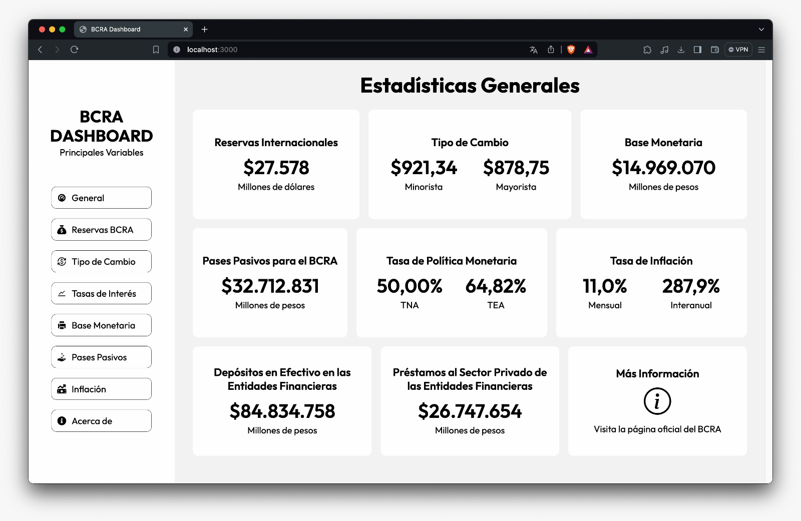

# BCRA Main Variables Dashboard

This project is a dashboard that displays the main variables of the BCRA (Banco Central de la República Argentina), which is the central bank of Argentina. The dashboard provides real-time data and visualizations for key economic indicators such as inflation rate, interest rates, exchange rates, and more.

The goal of this project is to provide users with an easy-to-use interface to monitor and analyze the main variables that impact the Argentine economy. By presenting the data in a visually appealing and interactive manner, the dashboard aims to help users gain insights and make informed decisions.



## Features

- Real-time data updates: The dashboard fetches the latest data from reliable sources and updates the visualizations in real-time.
- Interactive charts and graphs: Users can interact with the charts and graphs to explore the data in more detail and customize the view according to their needs.
- Historical data analysis: The dashboard allows users to analyze historical trends and compare different variables over time.
- User-friendly interface: The dashboard is designed to be intuitive and user-friendly, making it accessible to both experts and non-experts in economics.

## Installation

To run the BCRA Main Variables Dashboard locally, follow these steps:

1. Clone the repository:

```bash
$ git clone https://github.com/imanolgzz/bcra-mainvariables-dashboard.git
```

2. Install the required dependencies:

```bash
$ npm install
```

3. Start the development server:

```bash
$ npm run build
$ npm run start
```

4. Open your web browser and navigate to `http://localhost:3000` to access the dashboard.

## About

This project is developed using Next.js and utilizes various libraries and frameworks such as React Icons, Chart.js for data visualization, and dayJS for day parsing. It follows modern web development best practices and is designed to be scalable and maintainable.

- [BCRA Main Variables API](https://www.bcra.gob.ar/)
- [BCRA Home Page](https://www.bcra.gob.ar/)

The project is open-source and contributions are welcome. For more information, please visit the GitHub repository at [https://github.com/imanolgzz/bcra-mainvariables-dashboard](https://github.com/imanolgzz/bcra-mainvariables-dashboard).

**Version: 1.1.1 - May 6th, 2024**
